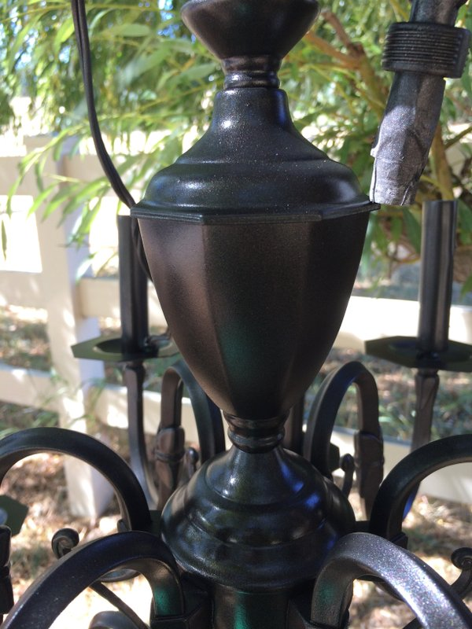

I think this chandelier makeover opened up Pandora's box for me in regards to refinishing light fixtures. I already have another beautiful chandelier I found on Craigslist for $40 sitting in storage until I figure out what to do with it.

Anyway, I really wanted a pretty chandelier in the dining room but didn't want to pay full price for one. I also didn't want to buy a really cheap one that would fall apart easily. This <a href="http://www.potterybarn.com/products/paige-metal-crystal-chandelier/?pkey=cchandeliers&&cchandeliers" target="_blank">chandelier from Pottery Barn</a> is the color and look I wanted, but this chandelier was too small for a dining room, I thought, and was $300.

After watching some chandelier make-over tutorials, I scoped out Craigslist for chandeliers and found this beauty right away.

It was listed for $90 but I ended up paying the guy $70. The size and number of lights was perfect for my dining room and it was a very solid, high quality piece. After slapping on some paint and throwing on some crystals, I ended up with this looker!

# Project Details

This project only cost me around $150 to complete ($70 for the chandelier; the rest for paint and crystals), and I got exactly what I wanted!

Materials/Tools I Used:
* Dish soap
* Rust-Oleum Universal Bonding Primer Spray Paint
* Rust-Oleum Universal Metallic Spray Paint & Primer - Oil Rubbed Bronze
* Roper Whitney hand punch
* Crystal garland and crystal teardrop pendants (see details below)

Initially I wanted to drill holes for hanging crystals using a drill but my dad suggested I use his Roper Whitney hand punch, which made it really easy. It's basically just a hole punch that can punch holes in metal. Also, I initially bought both my crystal garland and pendants from Amazon. The crystal pendants are actually glass but are still faceted and very sparkly. However, the crystals on the garland (they were also glass) were not faceted so they didn't quite sparkle enough for my liking. I found some faceted ones <a href="http://crystalplace.com/" target="_blank">here</a> (make sure you get the garland with the tiny key rings between each crystal to make hanging easy). They were a bit more expensive than the non-sparkly ones from Amazon, but SO worth it. I also found tiny crystal garlands like this at JoAnn Fabrics but I haven't priced them against the ones I bought.

I started by hanging the chandelier on a tree branch outside, filling a bucket with water and dish soap, and scrubbing it clean. I used steel wool for this step to roughen up the surface for the paint to stick to, but I don't think that was necessary since I sprayed it with bonding primer before the final paint coat. Next I rinsed it off with the hose and patted it dry. I'm inpatient and didn't wait long before spraying it with the primer, but I would suggest you let it air dry for a few hours before spraying any paint on it. I had water seep out of the little crevices after I painted and it caused the paint not to stick in those areas. Ugh.

Next I taped off areas I didn't want to paint, removed some of the loose pieces from the chandelier and went to town spraying the bonding primer. If you have a lot of surface area, you may have to use 2 cans of the primer. The primer is white and I actually really liked the look of the white chandelier, but I had already decided to paint it an oil rubbed bronze color.

After I let the primer dry based on the recommendations on the can, I sprayed it with the bronze color. I found it easiest to spray from the inside moving outward.

 It really sparkles in the sun!

I would let the paint dry for a day or two before messing with it to punch holes or hang crystals because the paint will be tacky for a while (learn from my inpatient mistakes). Actually, now I am remembering that I should have punched the holes *before* painting so I didn't have to touch up the scratches I made while punching.

I punched holes on the sides, front, and back of all 12 drip pans (bobeche? I don't know the correct term) with the Roper Whitney punch so I could attach my crystal garland in those places.

Then I just hung the crystal garlands and pendants until I ended up with the look I wanted!

And voila! I went from this ugly fan:

To my lovely chandelier!

Excuse the two-toned wall in the last picture (soon to be board and batten) and the lack of ANY kind of decor besides curtains. Definitely not to the decorating stage yet!

The last thing I did for the chandelier was install a dimmer so I can pick how bright the dining room is. Without the dimmer, it was too bright.

Thanks for reading!  :-)
