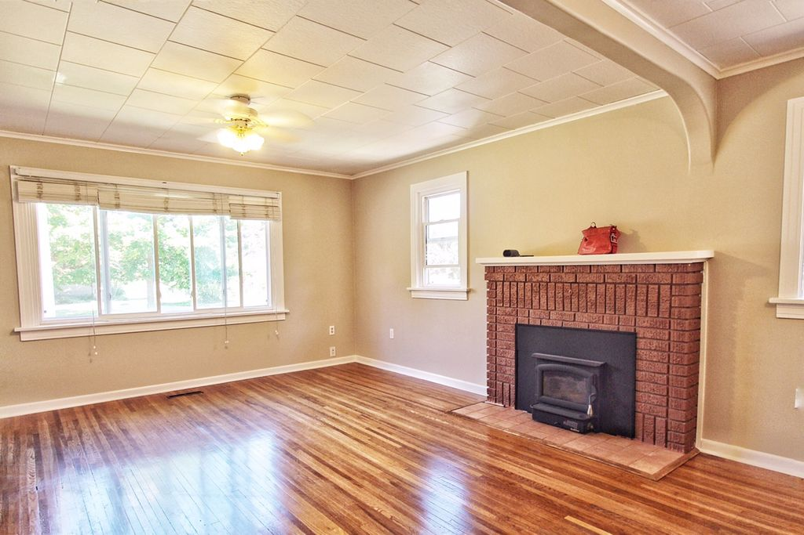
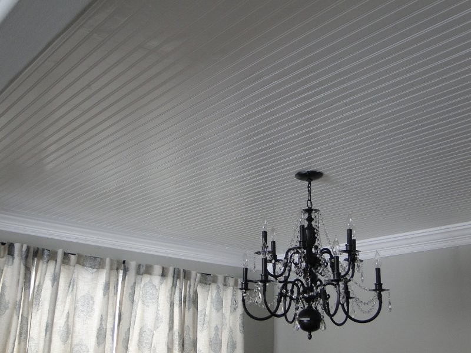

I feel like I have to start this post out by saying how *annoying* this project was. Most of the annoying-ness came from the beadboard planks I bought. I've already established that I am cheap in other posts, so I of course bought the cheapest plank (not panel) version of beadboard I could find at Lowe's.

I bought the pine Evertrue 3.56-in x 8-ft planks for $16 per pack (about 14 square feet). I opted for the planks instead of panels since the planks were longer meaning I would have fewer seams to patch. These planks are definitely not the highest quality. The planks have a tongue and a groove side and I would say most of the planks had either the tongue and/or groove broken. Each plank seemed to vary in both thickness and width which means you can see where I patched the seams if you look carefully. Lastly, the planks had a lot of imperfections and about 99% of the planks I bought were *not* straight! Thankfully they were slightly flexible.

I would completely recommend paying a couple extra dollars per pack of planks and getting some higher quality material. You should be able to just inspect the planks at the store and get a good idea of their quality. I was going to buy the higher quality planks for the dining room after learning I hated the planks for the living room, but my dad pointed out we didn't want them to look different. My parents, the positive souls they are, said all the imperfections give it a nice 'rustic' look and make it look old. I agree, now that the project is complete.

The other annoying part of this project was patching all the seams since both the dining room and living room are longer than 8 feet. I'll get into that below...

Anyway, I should start by showing you the ugliness that was the 'before' ceiling. I want to call the previous owner and ask why the heck they put these ugly foam squares up, but they cover all the upstairs ceilings except in the kitchen, bathroom, and hall...hence this ceiling makeover and those planned for my bedroom and office.

And here is the after! After patching the seams and putting up several coats of paint, I am happy with the results!

# Project Details
As I previously stated, this project was annoying and pretty time consuming. If my dad didn't have some of these tools, I probably wouldn't have been able to swing it!

Materials/Tools I Used:
* Crappy beadboard planks (I recommend using non-crappy planks)
* Miter saw
* Coping saw (to cut around light fixtures)
* Air compressor and nail gun (my air compressor came with a nail gun!)
* Brad nails (I used 2'')
* A construction square (to make sure you start your planks at the right angle)
* Wood filler (I used Elmer's...but there may be a better brand out there)
* Paintable caulk
* Medium grit sandpaper
* Loads of paint (I used semi-gloss for my sheen)
* Paint sprayer (I used a Wagner Power Painter Plus) for the first paint coat on the planks if they aren't already primed
* Paint brushes & roller
* A person to help hold up the planks while installing
* Time...lots of it
* Patience
* A good cry now and then

The first thing I did for this project was set up a paint booth in my enclosed back porch so I could spray the planks with my Wagner spray painter to make the final painting after installation easier. If the weather was nice, I could have done this outside, but it was really rainy when I started this project. I didn't have any saw horses so I just set up the boxes I had lying around from my recent move to lie my planks on. It took me about two painting sessions per room to get all the planks painted.

Zuli liked to keep the planks company after they had dried. Nobody likes working with lonely planks.

Next I had to figure out where the studs were in the ceiling. At first I was using one of those chalk lines to mark them, but quickly switched to just drawing on the ceiling because the chalk line was leaving red chalk EVERYWHERE. I am still wiping up red chalk. Then I (slowly) realized that the studs already lined up with the edges of the foam squares, so I stopped making any marks.

I initially wanted to put the beadboard up running north to south, but we had to put them up east to west since my studs ran north to south. You have to install it the opposite direction your studs run so you can nail the boards to studs.

My dad used the construction square to make sure we lined the first plank up at a 90 degree angle to the side wall. Apparently it is rare to have straight walls or perfect corners in a house. The dimensions of my rooms are definitely not the same on each side. We weren't concerned with setting the planks flush with the walls since I was putting up crown molding afterwards.

We started the first plank with the groove side pointing towards the direction we were adding planks, and using the nail gun, put 1 to 2 nails at each stud (2 nails at the ends). Each plank was 8 feet long but my living room is about 14.5 feet long. So we started on one side with the full 8 foot plank and then used the miter saw to cut about 1.5 feet off the next plank to finish that row. Then we started the next row on the side of the room we ended on with the full 8 foot plank with the tongue side of the plank inside the groove of the previous row and then finished with the 6.5 foot plank on the other side.

It didn't really matter where my seams ended up because I was going to try and make them disappear with wood filler, but this is how we did it. You want to make sure both ends of your planks end at a stud. Thankfully, both our long and short planks ended at a stud.

After doing several rows, my dad suggested our seams would line up better if we used the miter saw to shave off the end of the planks that would make the seam, even if it didn't need trimming. Turns out when you have crappy boards, the edges aren't usually nice, straight edges. Making a clean cut at the seam side definitely made my seams much nicer and easier to patch. Also, lining up the beads of both boards at the seams made for a much nicer patch job. This wasn't always possible since I found that these crappy boards weren't consistent in width.

You will also want to make sure your air compressor has enough pressure to push the nails in all the way. I think going back to hammer in the nails that didn't go in all the way is much more annoying than quickly filling the hole with wood filler.

As previously mentioned, the tongue and grooves of most of these planks were broken or messed up and barely any of the boards were straight. Getting the tongue of one plank into the groove of the plank next to it sometimes required some hammering, pulling, pushing, and cursing. The motto for this project quickly became 'it is what it is'.

Despite our issues, we started to make some good progress once we started to get the hang of it. My dad took the fans down in each room when we made it to the middle of the rooms and we worked by lamp light. He used the coping saw to cut a hole big enough to pull the wires for the light through.

When all the boards were up, I was left with these ugly seams! Gross!

So the next few weeks as I had time, I patched the seams with wood filler (the Elmer's stuff - make sure your wood filler can be sanded and painted over) and sanded and patched with wood filler and sanded and sanded and patched with wood filler and...you get the point. I really think this step wouldn't have been so painful if the planks were better quality. Since not all the planks were the same thickness, you can now see a defined slope at those now-patched seams.

I started putting on the wood filler with a putty knife but found that I had more control when I just put it on with my finger (health advisory - if you have a cut on your finger, put on a glove before using the wood filler or you might be subject to about 3 days of extreme itchiness all over your body...or so I hear). I think the trick to this is feathering the ends of the putty application so it is easier to blend when you sand. I also tried to apply it smoothly to make sanding easier.

I put the wood filler in the grooves around the beads, too, but tried to scrape out the excess before it dried so that sanding would be easier. Once the wood filler dried, I sanded each seam until it was smooth. I folded the sand paper in half and used the fold to sand in the grooves. I repeated this process of patching and sanding 2 to 3 times. I noticed that the dried wood filler cracked at the seam in some areas after only 1 or 2 applications, hence the additional applications. I'm not sure if that was due to the planks settling or because of the wood filler I used. Whatever it was, it was ANNOYING.

After all the seams were patched, I filled in any really big imperfections or holes with wood filler and sanded them smooth. I used some white paintable caulk to fill in some gaps you could see between planks. The coats of paint helped to seal everything up, too. I don't recommend using caulk to patch holes or anything because it *shrinks*. Yep, I tried that.

Once all the patching and sanding was done, it was time to paint! This stage is also really annoying and time consuming because you have to paint all the grooves with a paint brush. However, this really helps to hide any crevices or imperfections between planks. As a final step, I painted the whole ceiling with a smooth roller so I didn't leave any texture. I used Lowe's Valspar paint in Ultra White (their base white) in semi-gloss. The patched seams took extra coats of paint because the wood filler dried brown. If I had to do this again, against my will, I would used the wood filler that dries white. Make sure your final coat is done by the roller, though, to make sure your sheen is consistent (the brush seems to make the paint look shinier than the roller).

Even though I hated doing this project, I am really happy with the results!

Thanks for reading! :-)
