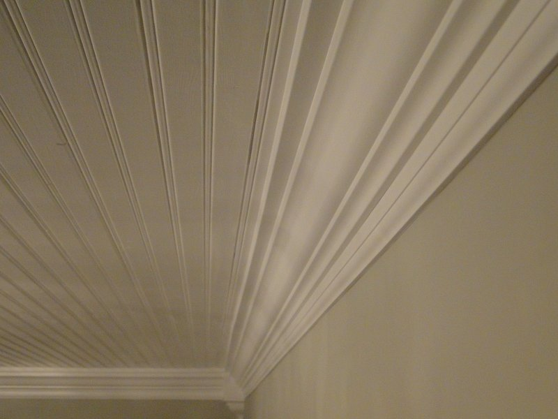

I found this project to be very satisfying. I've always loved the classic look of crown molding. If this stuff was edible, I would totally eat it. That's how much I like it.

I heard and read that doing built-up crown molding was easier and cheaper than buying the full pieces. Since my walls are not 100% straight or flat, it was nice having the flexibility of the 3 pieces that I used. You can also get pretty creative with the pieces you use depending on the final look you want.

Since I was painting over the crown molding, I bought MDF boards instead of wood. In hindsight, I'm glad I bought the MDF because it was flexible enough to tweak it in areas where my walls and/or ceilings had imperfections. For the top piece of my molding (the part that is attached to the ceiling), I used a 1.5''x.75'' board. The bottom piece (attached to the wall) is just a baseboard turned upside down. For the actual crown piece, I chose an option that was 3.5'' wide.

I originally went into this project not wanting to use corner pieces. But when my dad and I finally got to the corner cutting stage for the crown piece, our dyslexia kept us from moving forward. I broke down and decided to do the corner pieces to avoid the corner cuts (yeah, we cheated). I couldn't find any corner pieces online that exactly matched the projection (how far out the top piece comes on the ceiling) and drop (how far down the bottom piece goes down on the wall) of my setup. Then I found <a href="http://crowncorners.com/" target="_blank">crowncorners.com</a> and they make custom corner pieces that match your dimensions! The price wasn't too bad, they were really nice, and I received the pieces pretty quickly. Unfortunately, my dad and I will have to figure out how to cut the corners without using corner pieces because I have an odd corner in my bedroom that isn't a 90 degree angle. However, I actually do like the way the corner pieces look in the living and dining room!

Now for the important stuff...before and after pictures! The living and dining room already had crown molding but it was too small and simple for my taste. The first thing I did when I moved into the house was rip down all the crown molding with my favorite tool - the wonder bar.

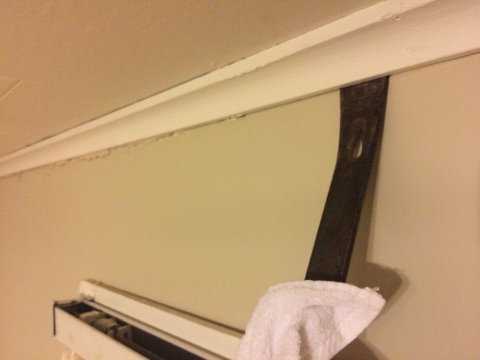

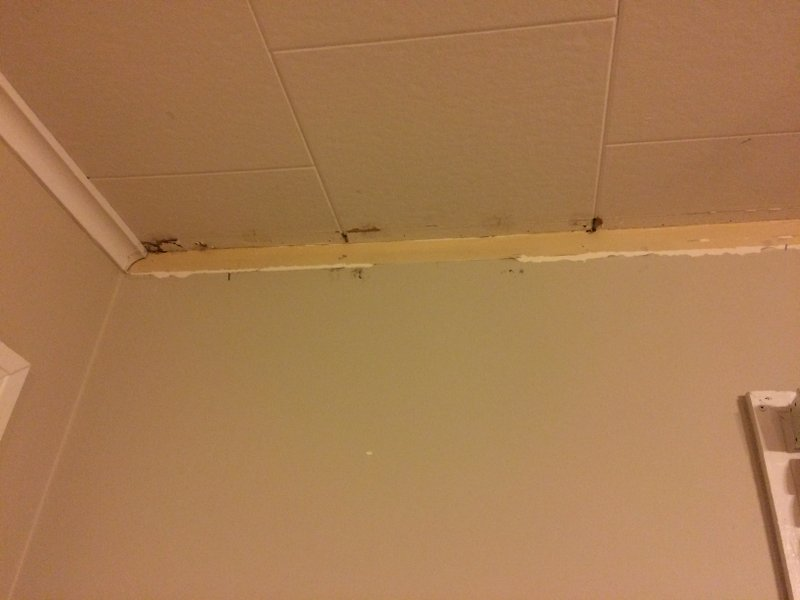

And here is the deliciousness of the final product.

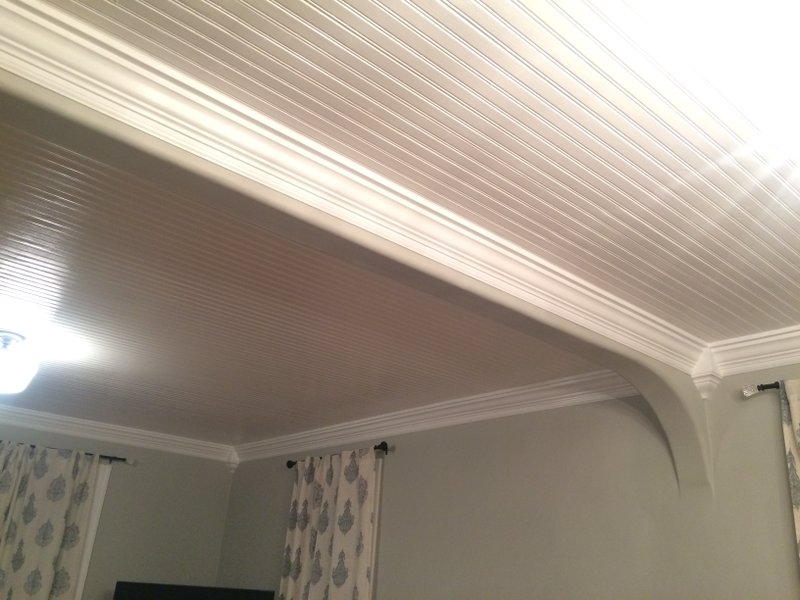

# Project Details

Materials/Tools I Used:
<ul>
  <li>MDF boards: top piece was a 1.5''x0.75'', bottom piece was a baseboard, crown piece was 3.5'' wide (try to get boards that are the full length and width of your room so you don't have to deal with seams)</li>
  <li>Miter saw</li>
  <li>Someone who knows how to do correct compound cuts with the miter saw...or corner pieces</li>
  <li>Someone to help hold up the boards when nailing</li>
  <li>Air compressor and nail gun (nail and hammer would work)</li>
  <li>Brad nails (I used 18 gauge 2'' brads)</li>
  <li>Hammer and nail set tool for driving in pesky brad nails</li>
  <li>Wood filler (my new fave brand is ZAR - the Elmer's brand cracks!)</li>
  <li>Medium grit sandpaper (for sanding nail holes and seams after wood filler)</li>
  <li>Paintable caulk</li>
  <li>Paint (I used semi-gloss for my sheen)</li>
  <li>Paint brushes</li>
  <li>Tape measure</li>
</ul>

Before doing anything, it is important to make a little model with all your pieces to figure out how everything will lie on the ceiling and wall. Unfortunately Lowe's didn't have little sample pieces, so when I was first picking out the boards in the store, I just lied in the middle of the lumber aisle and played with the shortest pieces I could find (8 feet...) to make sure the three pieces looked okay together.

To figure out the exact dimensions of the three pieces together, I cut a small piece off each of the pieces at home and laid them out on a piece of paper like the crown molding was popping out of the paper. I made sure the flat sides of the crown molding (the side that should touch the ceiling and the side that should touch the wall) were lying *flat* against the ceiling and wall piece. Then I made sure the whole piece looked balanced by making the top and bottom piece project out from the crown piece about an equal amount. Then when I was certain I had the layout I wanted, I measured the projection and drop of my model. My projection ended up being 3.5'' and my drop was 4.75''.

I'm not going to lie - my dad and I didn't initially make this model and ended up putting up and taking down boards from one wall about 4 times. I'm glad we didn't decide to use glue on the boards (we nailed at the studs) because this would have been really annoying and messy.

The next thing we did was go around and mark all the stud locations on the walls and the projection and drop measurements around the ceiling and walls. Instead of using a chalk line to draw a straight line for the projection and drop, we just made pencil marks every few feet. Those chalk lines leave chalk everywhere AND my walls and ceilings have weird bulges and dips that would make a straight line from one side of the room to the other pretty useless.

Next, we put up the corner pieces. The <a href="http://crowncorners.com/" target="_blank">crowncorners.com</a> site shows a few different ways to install these, but daddy was set on doing it his own way.

He screwed two 1''x2''s into the wall so they would sit right inside both sides of the corner pieces (they are not solid pieces). Since my walls and ceilings aren't all straight, the corner pieces didn't all fit perfectly into the corners. Good thing caulk is magical and can make the pieces look like they fit perfectly even if they don't (I will talk about the magic of caulking below). Here is a really horrible picture that shows one of the inside boards screwed in before putting up the corner piece.

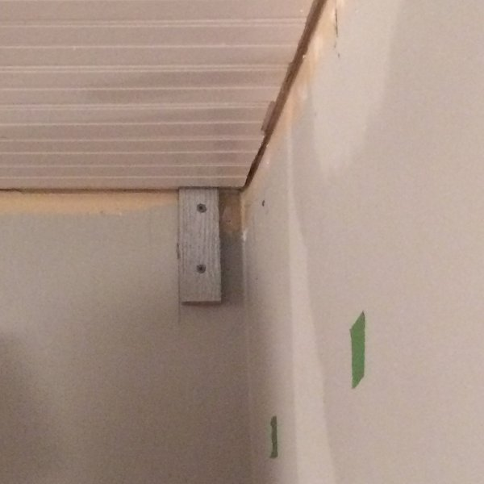

After the inside pieces were up, we were able to nail the corner pieces straight into them.

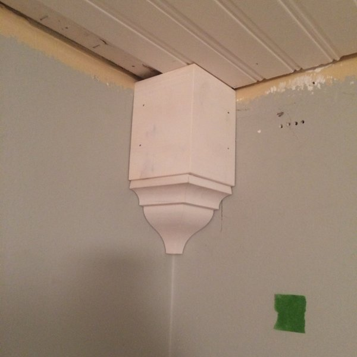

The cool thing about this project is you can nail most of the pieces in areas that would be hidden by the other pieces. If you do it right, you should only have to putty nail holes on the actual crown piece that goes up last.

Next, we put up the top (ceiling) and bottom (wall) pieces. Since the projection and drop of the flat part of the corner pieces were the exact dimensions we needed, we could line up the ends of our top and bottom boards with the corner piece. We lined both ends up with the two corner pieces, and then nailed from one side to the other while lining the board up with the marks we made on the wall and ceiling and ended with the opposite end lined up with the corner piece. This is where the flexibility of the boards came in handy. Also, I was able to find almost all my pieces in lengths that were long enough to span the entire length and width of the rooms. The top pieces were only 8 feet long, though, so I did end up patching a few little seams at the end.

You can see that the bottom piece in the first picture below doesn't meet the corner piece perfectly, but, as I mentioned before, caulk is a magical thing.

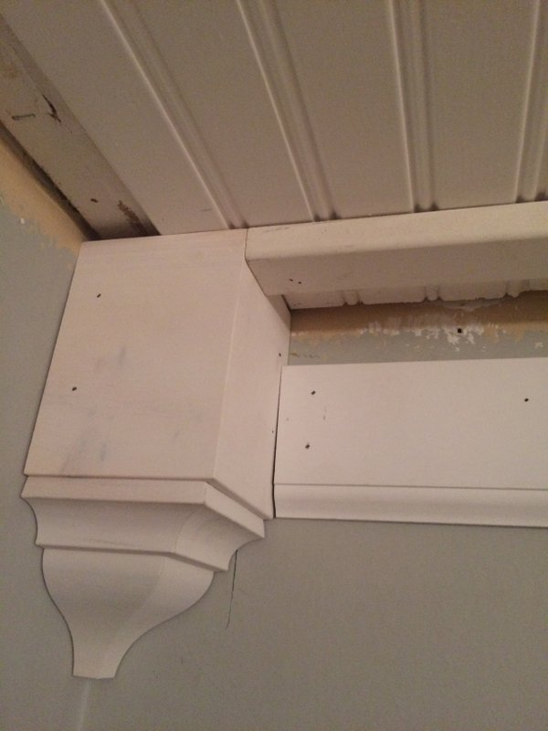

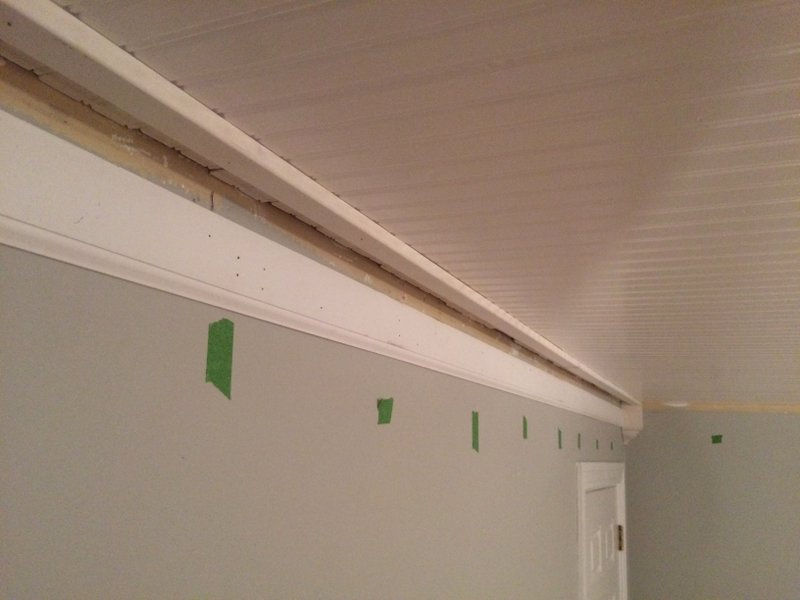

Then we put up the final crown piece. I didn't actually measure where the top and bottom of the crown piece would sit on the other two pieces. We just made sure that the flat sides of the crown were sitting flush/flat on the top and bottom pieces. That is how we knew the crown was aligned correctly. We had to be careful when we were nailing the crown since it was a bit awkward nailing it to the top board.

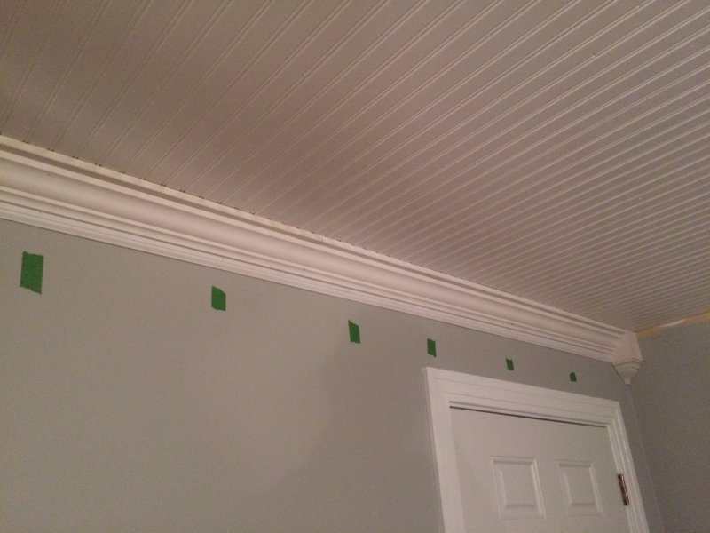

Then we just did this 7 more times to finish the living room and dining room. Thankfully we had Zuli to supervise and keep us on task.

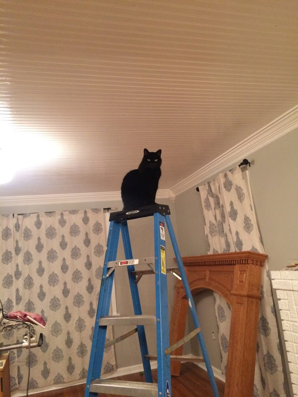

Next was the detail work - caulking, hammering in nails that didn't go in all the way, patching a few seams, and filling nail holes. There were some areas of the molding that had large spaces because of a dip in the wall or because we cut a piece too short. But, have no fear! Caulk makes everything looks perfect and polished. I put caulk in all of the seams. To do this, I just put a long line of caulk along the seam, used my finger to push it into the seam and flatten it, and then used a really wet rag to wipe away the excess. Here are some before and after pictures that show the beauty of caulking.

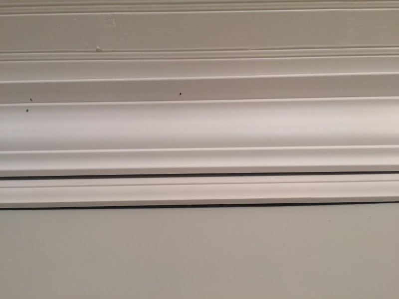

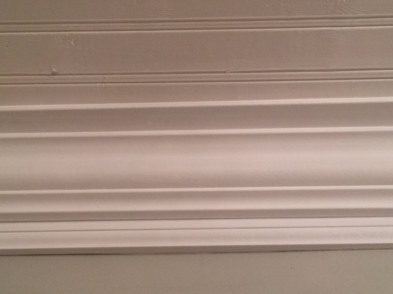

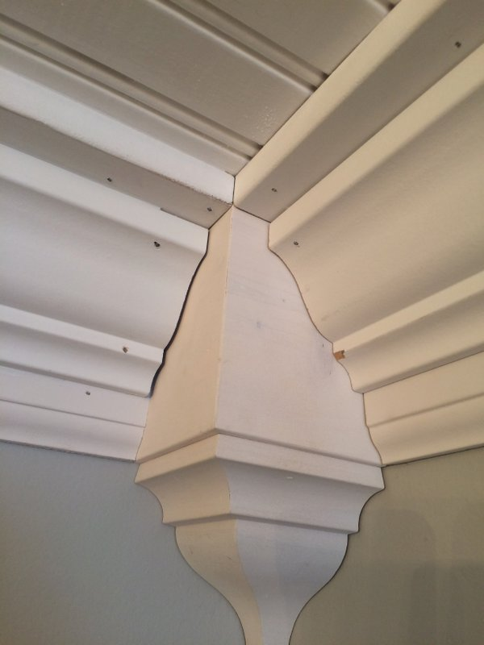

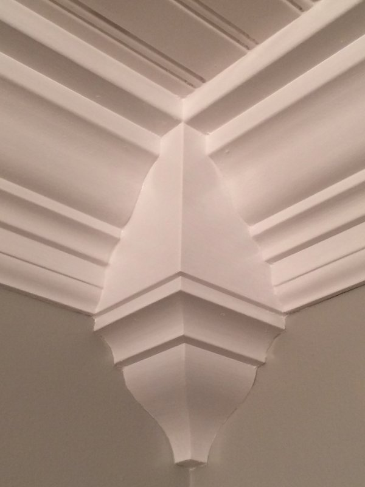

I used a <a href="https://www.thisoldhouse.com/ideas/humble-essential-nailset" target="_blank">nail set tool</a> to hammer in the brad nails that didn't go in all the way. I don't know what the heck is in my walls but there were just some nails I could not get in all the way.

Then came the painting stage! I used a semi-gloss sheen and used the same color as all my other molding and ceiling. I'm not a fan of using painters tape because it takes forever to put up and the paint usually still seeps underneath. So I painted the molding without worrying about getting the white paint on the wall. When I was done painting the molding, I went back around with wall paint and just carefully <a href="http://www.thepaintedsurface.com/how-to-cut-in.php" target="_blank">cut in</a> along the edges with a paint brush. You have to be really careful and move slow when you do this, but you save a ton of time and hassle by avoiding the taping step.

Alas! I ended up with this yummy crown molding!

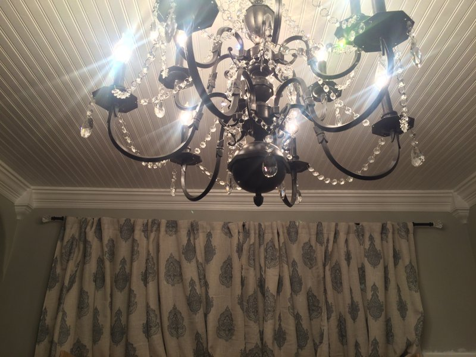

Next is my dining room board and batten project and my fireplace makeover!
