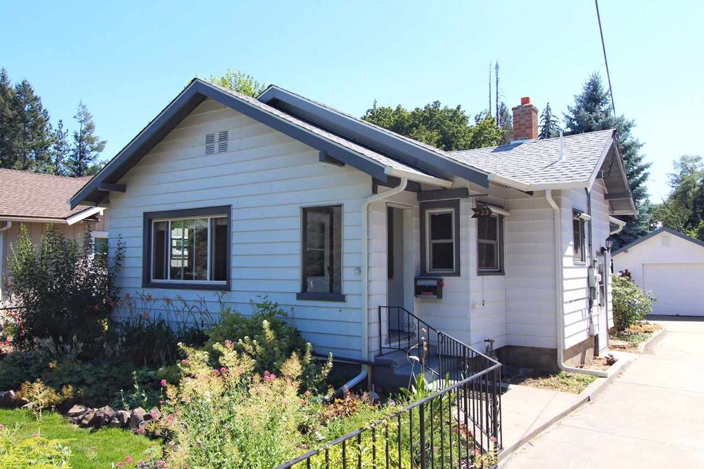
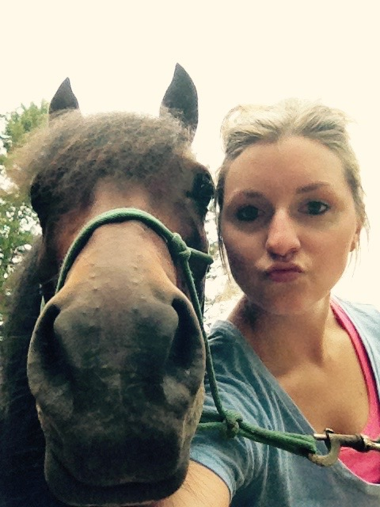

# About the house

Let me tell you, I'm super excited about this house! It was built in 1928 so it has the charm of an older house (them hardwoods, tho) but the previous owners did all the scary expensive upgrades already (replaced the lath and plaster with drywall, new electrical, new plumbing, enlarged kitchen, new roof, new gutters, forced air, etc., etc.).

I totally lucked out with this house's location. It's in such a quaint and well-kept area. The house has a pretty large fenced back yard with some raised beds. The floors upstairs are all the original hardwoods, except the bathroom. All the rooms are pretty spacious and there are more cabinets in this house than I know what to do with.

On the downside, there is only one bathroom (right now). The back enclosed porch needs to be redone because of some bad framing, a leaky metal roof, and cracked concrete from the bad framing. Most of the colors on the walls and ceilings are...interesting (the kitchen has green and blue walls with a gold ceiling) and the foam squares on the ceilings of many of the rooms are fug. I hate the light fixtures. They are either ugly fans or boob lights. I love crown moulding but this house has the tiniest crown moulding I think you can buy. Go big or go home. The kitchen and bathroom aren't super outdated, but I plan to give them some serious face lifts.


	../assets/img/house_living.jpg
	../assets/img/house_kitchen1.jpg
  ../assets/img/house_kitchen2.jpg
  ../assets/img/house_kitchen3.jpg
  ../assets/img/house_porch.jpg
  ../assets/img/house_yard.jpg

     

# About me

 Yep, that's a pony selfie.

 I'm an analyst by day for a super awesome healthcare company. In my free time, I'm usually giving loves to my two kitty kitties or my two pony ponies, hanging out with my folks or tiny social circle (I've been gone from Spokane for a while, or maybe I'm just really unpopular, idk), or trying to burn calories so I feel less guilty about my food addiction.

 
 	../assets/img/ponies1.jpg
 	../assets/img/ponies2.jpg
  ../assets/img/zuli.jpg
  ../assets/img/bianca.jpg
 
   

Meow.
